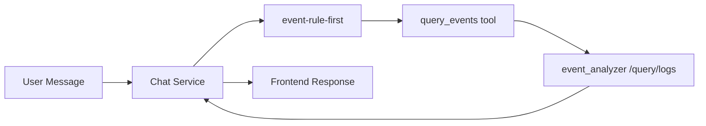
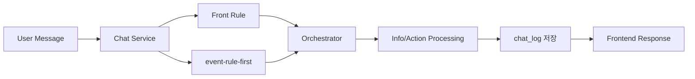

# Backend Flow Summary

현재 백엔드에서는 두 가지 흐름이 분리되어 동작합니다.

1. AI Log Event Analysis: 이벤트/로그 데이터를 조회하고 요약하는 흐름
2. AI Assistant Chat Analysis: 일반 대화, 화면 안내, 액션 실행을 처리하는 흐름

공통 진입점은 AI Chat Service이며, 요청은 chat service에서 reqId, routeKey, 대화 컨텍스트를 구성한 뒤 규칙 기반 처리와 오케스트레이터를 거칩니다.

## 1. AI Log Event Analysis

### 목적
사용자가 "오늘 이슈 보여줘", "high severity 이벤트", "주행 관련 오류" 같은 질문을 하면, 이벤트 로그를 조회해 요약된 결과를 반환합니다.

### 처리 흐름
1. 사용자의 메시지를 chat service가 수신합니다.
2. event-rule-first 단계에서 phrase-map 또는 DB event-rule로 질문을 먼저 매칭합니다.
3. 매칭된 규칙의 filtersTemplate를 기반으로 toolArgs를 생성합니다.
4. query_events tool이 실행됩니다.
   - 기간/심각도/기능/상태/키워드 정규화
   - alias 변환 및 기간 해석
   - event_analyzer의 /query/logs 조회
5. 조회 결과를 summary, sampleItems, resolvedFilters 형태로 정리해 응답합니다.
6. 최종 텍스트와 메타데이터를 프론트로 반환합니다.

### 핵심 모듈
- be/apps/ai_chat_service/src/service/chat.service.ts
- be/apps/ai_chat_service/src/domains/ai-log-event/event-rule-first.ts
- be/apps/ai_chat_service/src/db/query-phrase-map.repo.ts
- be/apps/ai_chat_service/src/db/event-rule.repo.ts
- be/apps/ai_chat_service/src/screens/robot/ailog-event.datatools.ts
- be/apps/event_analyzer/src/controller/query.controller.ts
- be/apps/event_analyzer/src/service/query.service.ts

### 주요 포인트
- phrase-map: 정규화된 고정 문구 매칭에 강함
- event-rule: 정규식 패턴으로 다양한 표현 변형 처리에 강함
- query_events는 event_analyzer와 직접 연동되어 로그 조회 결과를 반환합니다.

### 간단 흐름도


## 2. AI Assistant Chat Analysis

### 목적
일반적인 AI Assistant 대화, 화면별 안내, 액션 실행, RAG 기반 응답 생성을 처리합니다.

### 처리 흐름
1. 사용자의 메시지를 chat service가 수신합니다.
2. routeKey를 기준으로 현재 화면/컨텍스트를 결정합니다.
3. front-rule가 먼저 적용됩니다.
4. AI Log 이벤트 질문이면 event-rule-first가 우선 처리됩니다.
5. 그 외 요청은 orchestrator가 화면 설정과 intent를 분석합니다.
6. intent에 따라 분기합니다.
   - info: RAG 조회 또는 기본 LLM 응답
   - action: tool 실행 및 액션 결과 조합
7. 최종적으로 chat_action, chat_action_param, text를 반환합니다.
8. 결과는 chat_log에 저장됩니다.

### TMS/TaskFlow Canvas 연계 흐름
TMS 쪽에서는 AI Assistant가 단순한 텍스트 응답이 아니라 Canvas의 flow draft를 직접 생성하는 역할까지 수행합니다.

1. 프론트에서 Canvas 컨텍스트를 수집해 flowContext, taskflow, taskContents, fullFlow를 요청 payload에 담습니다.
2. 백엔드는 해당 컨텍스트를 기반으로 intent를 분류하고, TMS 전용 compose 모듈로 진입합니다.
3. compose_linear_taskflow가 요청 의도를 해석합니다.
   - 모드 전환, 저장, 삭제, 정렬 요청은 clarification 또는 draft 재구성으로 처리합니다.
   - PickUp, PlayMotion, Move 같은 도메인 요청은 각각 전용 노드 조합을 생성합니다.
4. 생성된 draft는 Canvas에 바로 반영할 수 있는 chat_action + chat_action_param 형태로 반환됩니다.
5. 프론트는 assistant 메시지와 함께 draft를 적용해 사용자에게 시각적으로 보여줍니다.

### TMS 흐름도
```mermaid
flowchart LR
    U[User Message on TMS Canvas] --> C[Frontend builds flowContext/taskflow]
    C --> S[Chat Service]
    S --> O[Orchestrator]
    O --> T[screen-registry / TMS compose]
    T --> D[compose_linear_taskflow]
    D --> B{Intent Type}
    B -->|PickUp| P[PickUp -> DoesObjectExist -> PutDown]
    B -->|PlayMotion| M[Parallel(PlayMotion + Tts)]
    B -->|Move| V[Parallel(MoveTo + PlayFace/PlaySound)]
    B -->|General| G[Linear task flow draft]
    P --> A[Return chat_action + draft]
    M --> A
    V --> A
    G --> A
    A --> F[Frontend applies draft to Canvas]
```

### 핵심 모듈
- be/apps/ai_chat_service/src/service/chat.service.ts
- be/apps/ai_chat_service/src/domains/front-rule/front-rule-engine.ts
- be/apps/ai_chat_service/src/pipeline/chat.orchestrator.ts
- be/apps/ai_chat_service/src/pipeline/screen-registry.ts
- be/apps/ai_chat_service/src/db/chat-log.service.ts
- be/apps/ai_chat_service/src/db/prompt-store.service.ts

### 처리 우선순위
1. front-rule
2. event-rule-first
3. orchestrator
4. guidance fallback

### 간단 흐름도


## 3. 운영 포인트

- reqId 기준으로 단계별 로그를 추적할 수 있습니다.
- 이벤트 분석은 event_analyzer 쪽 조회 결과를 중심으로 동작합니다.
- 채팅 분석은 화면별 룰과 오케스트레이터를 중심으로 동작합니다.
- 룰은 코드보다 DB 기반으로 유연하게 관리되는 구조입니다.
